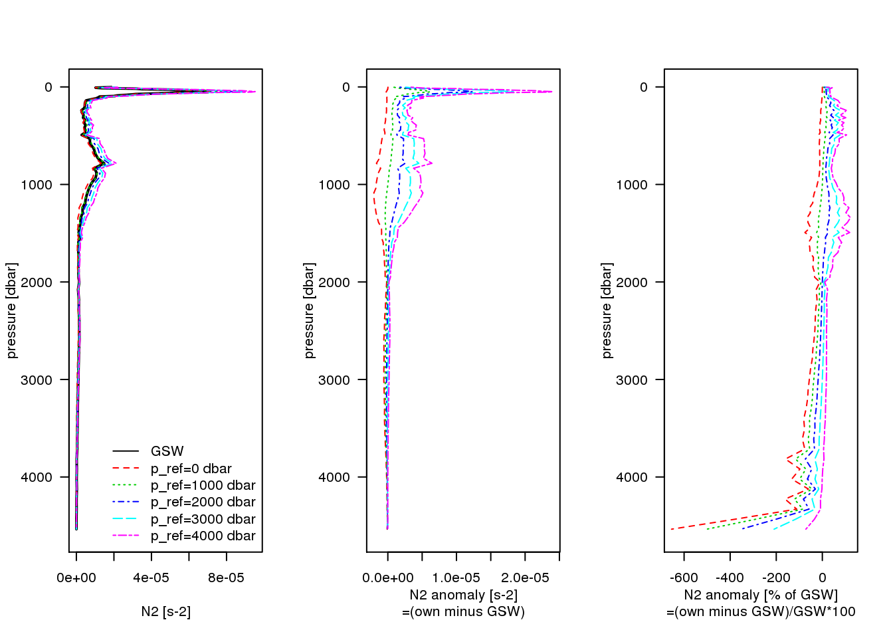

# $N^2$ confusion

The squared buoyancy frequency is defined as $N^2 \sim -\frac{g}{\rho} \frac{\Delta \rho^\Theta}{\Delta z}$ where $\Delta \rho^\Theta$ is 
> "the difference between the potential densities of the two seawater parcels with the reference pressure being the average of the two original pressures of the seawater parcels." ([TEOS-10 Handbook, p. 32, eq. 3.10.2.](http://www.teos-10.org/pubs/TEOS-10_Manual.pdf)).

In the `gsw` package, this is implemented via the [`gsw_Nsquared(SA,CT,p,{lat})`](http://www.teos-10.org/pubs/gsw/html/gsw_Nsquared.html) function. Here, the argument `p` represents the absolute pressure in dbar.

In addition, $N^2$ can be calculated by hand via<br> 
$$
-\frac{g}{\rho_\text{p\_mid}} \frac{\Delta \rho^\Theta}{\Delta z} = -\frac{g}{\rho} \left( \frac{\rho_\text{p\_ref,upper}^\Theta - \rho_\text{p\_ref,lower}^\Theta}{z_\text{upper} - z_\text{lower}} \right)
$$
where $g = \mathtt{gsw\_grav(latitude, p)}$, $\rho_\text{p\_mid} = \mathtt{gsw\_rho(SA, CT, p\_mid)}$, $\rho^\Theta_\text{p\_ref} = \mathtt{gsw\_rho(SA, CT, p\_ref)}$, $\text{p\_mid}$ is the average pressure between two depths and the different references pressures $\text{p\_ref} = (0, 1000, 2000, 3000, 4000)$ dbar.

You can find the code for obtaining $N^2$ via both methods in [n2_confusion.Rmd](https://github.com/chrisdane/n2_confusion/blob/master/n2_confusion.Rmd). With
```
git clone https://github.com/chrisdane/n2_confusion.git
```
you can reproduce the `html` version of the script ([n2_confusion/_book/n2-confusion.html](https://github.com/chrisdane/n2_confusion/blob/master/_book/n2-confusion.html)).

# Results

The plot shows absolute values of $N^2$ (left), differences between the default method (GSW) and using different reference pressures $\mathtt{p\_ref}$ ($\mathtt{p\_ref}$ minus GSW; middle) and these differences as % of the default GSW method (right).

The underlying data is the World Ocean Atlas 2018 climatology (1955-2017) at the $20.125^{\circ}$ West and $47.375^{\circ}$ North gridbox ([Locarnini et al. 2018 and Zweng et al. 2018](https://www.nodc.noaa.gov/OC5/woa18/)).



